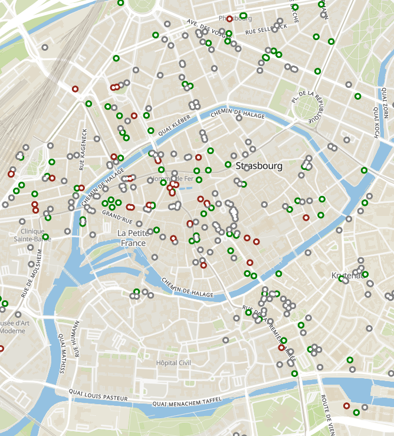

# Öffentlicher Aufruf zur Beteiligung bei „Bleibt offen“

Ein Appell an alle jetzt mitzumachen: An alle Mitbürger, Verwaltungen, Gesellschaften, Körperschaften, öffentlichen und privaten Akteure, an alle von der aktuellen Covid19-Krise Betroffene: teilen Sie Ihr Wissen und Ihre Daten.

Die aktuelle Notsituation erfordert dringend, dass wir unsere Kräfte auf pragmatische Art und Weise bündeln.

**Ihr Beitrag als engagierte Bürger**

Als Anwohner können Sie [direkt auf der Karte](https://www.bleibtoffen.org/) die offenen Orte in der eigenen Nachbarschaft angeben. Dies erfordert keine besonderen technischen Fähigkeiten.

**Halten Sie sich an die gesetzlichen Vorschriften. Es liegt in Ihrer Verantwortung.**

Wenn Sie auf einen Ort auf der Karte klicken, können Sie über die Schaltfläche "ÄNDERUNG MELDEN" angeben, ob das Geschäft offen oder geschlossen ist. Genauso können Sie auch die während der Covid19-Krise geltenden vorübergehenden Öffnungszeiten und andere nützliche Informationen (z.B. Kontaktdaten) hinzufügen.

Fehlt zum Beispiel der Standort eines Geschäfts, kann das verschiedene Gründe haben:

* Es ist ein Geschäft, das gemäß der gesetzlichen Bestimmungen derzeit nicht geöffnet haben darf. Dann ist es richtig, dass man das Geschäft nicht auf der Karte sieht.
* Es sollte auf der Karte vorhanden sein, es fehlt allerdings in OpenStreetMap. Das können Sie selbst in die Hand nehmen: es ist kostenlos, dauert weniger als 5 Minuten und erfordert nur das Einrichten eines OpenStreetMap-Kontos. Wir haben eine kleine [Anleitung](../geschaeft-fehlt/index.html) verfasst, die hierbei helfen soll.

Wenn Sie bereits bei OpenStreetMap dabei sind, finden Sie im OpenStreetMap Wiki weitere, nützliche Informationen. Im Forum können Sie auch Fragen stellen und diskutieren.

* [OpenstreetMap Wiki](https://wiki.openstreetmap.org/wiki/Key:opening_hours:covid19)
* [Diskussionsforum](https://forum.openstreetmap.org/viewforum.php?id=14)

Wenn Sie es schaffen, Ihr Viertel oder sogar Ihre Stadt zu kartieren, können Sie die Gemeindeverwaltung informieren, und ihnen das Projekt vorstellen.

Sprechen Sie mit und über uns auf Twitter und Facebook.

* [Twitter](https://twitter.com/bleibtoffen)
* [Facebook](https://www.facebook.com/bleibtoffen)

Die Software, mit der wir die Karte erstellen ist Open Source. Der Quellcode ist offen und gut dokumentiert und auch die anstehenden Entwicklungen der Webseite sind öffentlich einsehbar: [https://github.com/osmontrouge/covid19_map](https://github.com/osmontrouge/covid19_map). Wenn Sie technische Kenntnisse haben, ist Ihre Hilfe herzlich willkommen.

#### Öffentliche und private Akteure: Integrieren Sie Ihre Daten in OpenStreetMap

Viele Gemeinden tragen bereits zu OpenStreetMap bei. Dieses Projekt ist heute eine direkte Antwort auf das aktuelle Krisenproblem: Welche Geschäfte in Ihrem Umkreis haben offen? Welche sind geschlossen?

Wenn Sie bereits Daten von Händlern und anderen Geschäften in Ihrer Umgebung gesammelt haben, können Sie diese Daten direkt in OpenStreetMap einpflegen. Die IT- oder GIS-Abteilung Ihrer Firma wird sicher helfen können. Wir haben die technischen Spezifikationen auf einer speziellen Seite ausführlich beschrieben.

* [Technische Spezifikationen](https://wiki.openstreetmap.org/wiki/DE:Key:opening_hours:covid19)

Falls Ihre Firma nicht über die erforderlichen Kompetenzen im eigenen Haus verfügt, können Sie sich auch an einen der Dienstleister wenden, die auf dieses Gebiet spezialisiert sind.

* [Dienstleister](https://wiki.openstreetmap.org/wiki/Commercial_OSM_Software_and_Services)

Sobald die Daten in OpenStreetMap integriert sind, erscheinen die Öffnungszeiten mit einer kleinen Verzögerung auf der Seite [Bleibt offen](https://www.bleibtoffen.org). Diese Webseite kann als Informationsportal von den Bürgerinnen und Bürger benutzt werden.