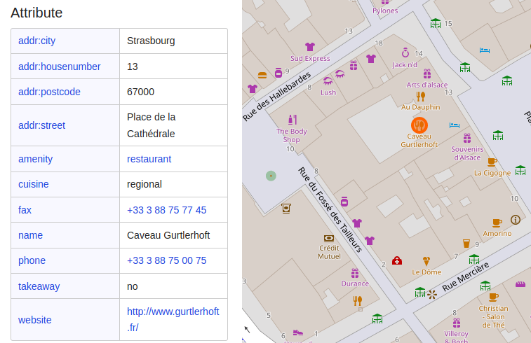

## "CA RESTE OUVERT": Ein Kommunikationsinstrument für Gemeinden

Immer mehr Gemeinden verwenden "CA RESTE OUVERT" als Kommunikationsmittel bei der Bewältigung der Covid19-Krise, wie zum Beispiel die Stadt Lyon.

Ortsverwaltungen, Gemeinden, Landratsämter, Regierungsbehörden: Informieren Sie Ihre Bürger über dieses nützliche Instrument bei der Eindämmung von Covid19.

#### Teilen Sie die Website "CA RESTE OUVERT"

Sie müssen nur den Link zu unserer Website [www.caresteouvert.fr](https://www.caresteouvert.fr) weitergeben und hinzufügen, dass man hier Informationen über geöffnete Geschäfte findet und darum bitten, fehlende Informationen zu ergänzen. Sie haben auch die Möglichkeit, unsere Karte in einem Iframe auf Ihrer eigenen Website zu integrieren.

Vielleicht haben Sie bereits die auf Ihrem Gebiet geöffneten Geschäfte gesammelt: Öffnungszeiten, Lieferbedingungen, Telefonnummern ... Sie können die Informationen über diese Orte direkt auf der Karte "CA REST OUVERT" ändern.

Sie können diese Änderungen auch direkt in OpenStreetMap vornehmen. Die IT- oder GIS-Abteilung Ihrer Verwaltung kann die bei Ihnen vorhandenen Daten integrieren. Genauere technische Informationen finden Sie unter [https://wiki.openstreetmap.org/wiki/DE:Key:opening_hours:covid19](https://wiki.openstreetmap.org/wiki/DE:Key:opening_hours:covid19).

#### Bedingungen und Konditionen der Nutzung

Das Dschungelbusunternehmen genehmigt kostenlos jede Nutzung der Marke und des Logos "CA REST OUVERT" durch lokale Behörden im Rahmen ihres öffentlichen Auftrags.

Wie in den rechtlichen Hinweisen angegeben, werden die Website [www.caresteouvert.fr](https://www.caresteouvert.fr) und jedes der Elemente, aus denen sie besteht, insbesondere die Texte, Bilder, Fotos und Illustrationen, unter einer CC-BY-SA-Lizenz zur Verfügung gestellt. Die örtlichen Behörden können sie daher auch in ihrer Kommunikation verwenden.

Die Karte selbst und die zugrundeliegenden Daten stehen alle unter der OdbL-Lizenz, der Lizenz von OpenStreetMap. Beachten Sie die Lizenz mit der Ihre Verwaltung offene Daten zur Verfügung stellt.

#### OpenStreetMap entspricht der Datenschutz-Grundverordnung

OpenStreetMap erfüllt die Anforderungen der DSGVO. OpenStreetMap ist ein strukturiertes, organisiertes Projekt, mit einer durchdachten Datenschutzrichtlinie und präzisen Bedingungen und Konditionen. Insbesondere besteht das Prinzip des Projekts darin, nur öffentliche Daten zu sammeln.

Beispiel für Daten in diesem Zusammenhang ist das Restaurant "Caveau Gurtlerhoft" in OpenStreetMap: Adresse, Telefonnummer, Internetseite. Diese Daten sind öffentlich und unterliegen daher nicht der Regelung zum Schutz personenbezogener Daten.

Die OpenStreetMap-Community besteht aus vielen Tausend engagierten Bürgern sowie Unternehmen, öffentlichen Akteuren ..., die Zeit und Energie investieren, um diese strengen Datenschutzregeln innerhalb des Projekts durchzusetzen.